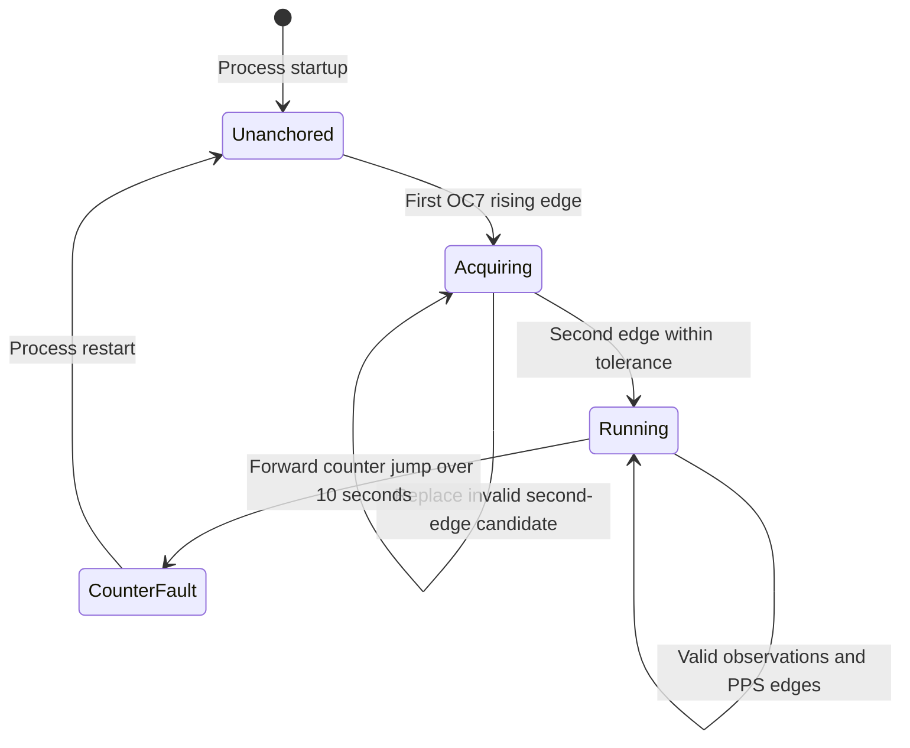

# sentireader_rust

Rust library for reading and parsing the Sentiboard serial stream. It includes
parsers for the STIM300 IMU, u-blox ZED-F9P GNSS receivers, and the Waterlinked
A50 and Nortek Nucleus1000 DVLs.

The ROS nodes, published topics, LiDAR integration, GNSS conversion services,
and complete timing architecture are documented in
[`blueboat_sentinode/impl_doc.md`](../blueboat_sentinode/impl_doc.md).

## Serial reader

`SentiReader` normally reads `/dev/ttySentiboard02`. It scans for the `^B` or
`^C` synchronization marker, validates the header and payload Fletcher-16
checksums, and returns a `SentiboardMessage` containing:

- the sensor ID;
- the raw 32-bit time of validity (`TOV`), time of arrival (`TOA`), and time of
  transport (`TOT`) counters;
- the sensor payload;
- an optional onboard floating-point timestamp; and
- `host_receive_time`, sampled with `SystemTime::now()` immediately after the
  synchronization bytes are observed.

`^C` frames contain the optional eight-byte onboard timestamp before the three
counter fields. The reader normalizes the marker internally before validating
the header. `host_receive_time` describes host-side serial arrival and can be
used for transport and stale-frame checks; it does not define or discipline the
Sentiboard measurement clock.

The reader exposes cumulative valid-frame and resynchronization-byte counters.
When session logging is enabled, `LoggingReader` also exposes logging drop and
error counters.

## Sensor parsers

After `SentiReader` validates and separates a frame, the parser modules decode
the payload for the selected sensor:

- `stim300_parser` decodes STIM300 inertial data and its sample counter;
- `ublox_f9p_parser` decodes the supported UBX navigation, receiver, monitor,
  security, raw-observation, and relative-position messages;
- `dvl_a50_parser` and `dvl_nucleus1000_parser` decode the supported DVL wire
  formats.

These modules return Rust data structures. ROS message construction and topic
selection belong to `blueboat_sentinode`.

## Sentiboard counter mapping

The library's `sentiboard_clock::SentiboardClock` maps the free-running 100 MHz
Sentiboard counter into a synthetic time domain:

- one counter tick is 10 ns;
- two consecutive OC7/PPS rising edges acquire the clock, and the second
  accepted edge becomes synthetic epoch `2000-01-01T00:00:00`;
- the raw 32-bit counter is unwrapped into an internal 64-bit counter;
- natural rollover is accepted, and recent negative deltas do not move the
  unwrap cursor backward;
- a forward movement greater than 1,000,000,000 ticks (10 seconds) enters a
  sticky `CounterFault`; and
- later PPS edges update availability, interval, frequency, sequence, and
  jitter diagnostics but never re-anchor the clock.

The externally visible states are:

Until the second accepted OC7 edge, `counter_to_time()` returns `None`. In
`Running`, it returns the synthetic epoch plus the unwrapped tick offset. A
process restart creates a new synthetic epoch, so timestamps from different
runs are not directly comparable without an additional run or epoch identifier.

GNSS, host realtime, PTP, and NTP are intentionally not inputs to
`SentiboardClock`.
The separate GNSS relationship, timestamp publication rules, chronology
limitations, and external-computer synchronization procedure are canonical in
the [Sentiboard timing implementation document](../blueboat_sentinode/impl_doc.md).
